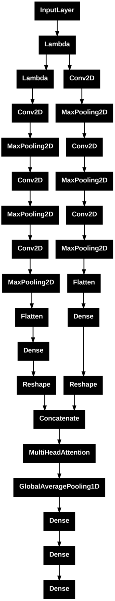

# PCOS Ultrasound Image Classification using Two-Stream CNN & Transformer Attention

This deep learning project aims to classify ultrasound images of ovaries into two categories — **infected (PCOS)** and **non-infected** — using a custom architecture that combines a **Two-Stream Convolutional Neural Network (CNN)** and **Transformer Attention** layers.

## 📁 Project Structure


---

## 🔍 3. Dataset Details

```markdown
## 📂 Dataset

The dataset used is **[PCOS-XAI-Ultrasound](https://www.kaggle.com/datasets/ibadeus/pcos-xai-ultrasound-dataset)** containing ultrasound images categorized as:

- `infected` (with PCOS)
- `noninfected`

It was downloaded using:

```python
import kagglehub
path = kagglehub.dataset_download("ibadeus/pcos-xai-ultrasound-dataset")

---

## 🧹 4. Data Preprocessing & Augmentation

```markdown
## 🧹 Data Preprocessing & Augmentation

Balanced and augmented the dataset to handle class imbalance:

```python
from sklearn.utils import resample

# Balance dataset
max_count = df['category_encoded'].value_counts().max()
dfs = []

for category in df['category_encoded'].unique():
    class_subset = df[df['category_encoded'] == category]
    class_upsampled = resample(class_subset, replace=True, n_samples=max_count, random_state=42)
    dfs.append(class_upsampled)

df_balanced = pd.concat(dfs).sample(frac=1, random_state=42).reset_index(drop=True)

---

## 🏗️ 5. Model Architecture (Two-Stream CNN + Transformer)

```markdown
## 🏗️ Model Architecture

The model splits the input image into upper and lower halves:
- Applies separate CNN pipelines to each half
- Uses **Multi-Head Self-Attention** on the combined feature embeddings

🖼️ Here's the architecture:



You can also find the model saved as:
- `model_architecture.json`
- `model_weights.weights.h5`
